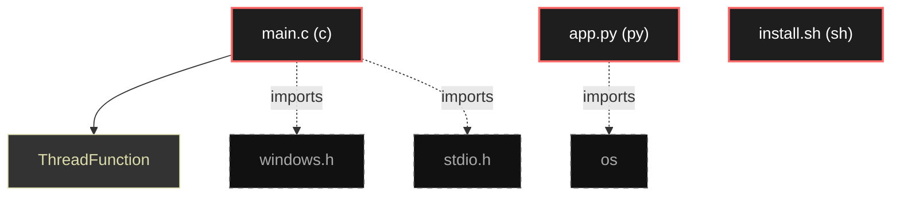

# Polyglot Codebase Knowledge Graph

> Generated offline by **readmenator**. Supports C, C++, Python, Go, Rust, JS/TS, Java, C#, Shell, PHP, Dart, GDScript, Nim, ASM.
> No LLMs. No tokens. Pure static analysis. See more [here](https://github.com/grisuno/ReadMenator)

**Total Files Parsed:** 3 | **Total Symbols Extracted:** 1 | **Total Imports:** 3

## Structural Knowledge Map

---

## Architecture Reference

### C (1 files)

#### `main.c`
**Path:** `main.c`

**Functions:**
- `ThreadFunction` (line 10) `DWORD WINAPI ThreadFunction(LPVOID lpParameter)`

### PY (1 files)

#### `app.py`
**Path:** `app.py`

*No symbols extracted*

### SH (1 files)

#### `install.sh`
**Path:** `install.sh`

*No symbols extracted*
